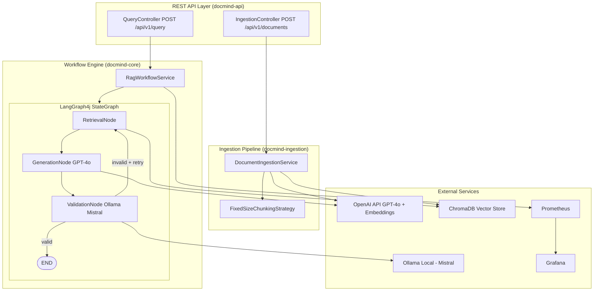

# DocMind — Multi-Model RAG Knowledge Assistant
> **Production-ready AI application** built with Spring Boot 3.3.5, Spring AI 1.0.0, and LangGraph4j 1.8.17

[](https://github.com/your-org/docmind/actions)
[](https://openjdk.org/)
[](https://spring.io/projects/spring-boot)
[](https://spring.io/projects/spring-ai)
[](https://github.com/bsorrentino/langgraph4j)
[](LICENSE)

---

## 🎯 What is DocMind?

DocMind is a **Retrieval-Augmented Generation (RAG) Q&A system** that lets you:

1. **📄 Ingest** documents (PDF, plain text) into a ChromaDB vector knowledge base
2. **🤖 Query** that knowledge base using natural language
3. **✅ Receive** grounded, validated answers with source citations

The AI pipeline is orchestrated by **LangGraph4j** — a stateful multi-step graph:

```
User Query → [Retrieve Docs] → [Generate (GPT-4o)] → [Validate (Mistral)] → Response
                    ↑___________________________(retry if answer invalid)___|
```

---

## 🏗️ Architecture



---

## 🚀 Quick Start

### Prerequisites

| Tool | Version | Install |
|------|---------|---------|
| Java | 21 LTS | [Eclipse Temurin](https://adoptium.net/) |
| Maven | 3.9+ | `brew install maven` |
| Docker | 24+ | [Docker Desktop](https://www.docker.com/products/docker-desktop/) |
| OpenAI API Key | — | [platform.openai.com](https://platform.openai.com/) |

### 1. Clone and Configure

```bash
git clone https://github.com/your-org/docmind.git
cd docmind
cp .env.example .env
# Edit .env — add your OPENAI_API_KEY
```

### 2. Start the Stack

```bash
# Start ChromaDB, Ollama, Prometheus, and Grafana
docker compose up -d chromadb ollama prometheus grafana

# Pull the Mistral model into Ollama (one-time, ~4GB download)
docker exec docmind-ollama ollama pull mistral

# Build and start the DocMind application
./mvnw clean package -DskipTests
./mvnw spring-boot:run -pl docmind-api
```

### 3. Use the API

```bash
# Ingest a document
curl -X POST http://localhost:8080/api/v1/documents \
  -F "file=@/path/to/your.pdf" \
  -F "sourceTag=my-docs"

# Ask a question
curl -X POST http://localhost:8080/api/v1/query \
  -H "Content-Type: application/json" \
  -d '{"query": "What is the main topic of the uploaded document?"}'
```

### 4. Explore

| URL | Description |
|-----|-------------|
| `http://localhost:8080/swagger-ui.html` | Interactive API docs (Swagger UI) |
| `http://localhost:8080/actuator/health` | Application health |
| `http://localhost:8080/actuator/prometheus` | Raw Prometheus metrics |
| `http://localhost:9090` | Prometheus UI |
| `http://localhost:3000` | Grafana Dashboard (admin/admin) |

---

## 📦 Project Structure

```
docmind/
├── docmind-common/          # Shared DTOs, domain exceptions (no Spring deps)
│   └── dto/                 # QueryRequest, QueryResponse, DocumentMetadata, ApiError
│
├── docmind-ingestion/       # Document parsing, chunking, embedding
│   ├── chunking/            # ChunkingStrategy interface + FixedSizeChunkingStrategy
│   ├── config/              # IngestionProperties (@ConfigurationProperties)
│   └── service/             # DocumentIngestionService (Tika → Chunks → VectorStore)
│
├── docmind-core/            # LangGraph4j workflow engine
│   ├── config/              # AiClientConfig (dual ChatClient beans)
│   └── workflow/
│       ├── RagState.java    # AgentState with Channel schema
│       ├── RagGraphConfig.java  # StateGraph compilation (@Bean)
│       ├── RagWorkflowService.java  # Spring service: invoke graph, map response
│       └── node/
│           ├── RetrievalNode.java   # ChromaDB similarity search
│           ├── GenerationNode.java  # OpenAI GPT-4o answer generation
│           └── ValidationNode.java  # Ollama Mistral LLM-as-Judge validation
│
├── docmind-api/             # Spring Boot application + REST API
│   ├── DocMindApplication.java
│   ├── controller/          # QueryController, IngestionController
│   ├── exception/           # GlobalExceptionHandler (RFC 7807)
│   ├── config/              # OpenApiConfig (Swagger)
│   └── resources/
│       └── application.yml  # All configuration (externalized)
│
├── Dockerfile               # Multi-stage, layered JAR build
├── docker-compose.yml       # Full local stack (ChromaDB, Ollama, Prometheus, Grafana)
├── .github/workflows/ci.yml # GitHub Actions (build, test, Docker push, security scan)
├── README.md                # This file
├── LEARNING.md              # Spring AI + LangGraph4j deep-dive + interview Q&A
└── INTERVIEW.md             # System design, scaling, behavioral questions
```

---

## 🔑 Environment Variables

Copy `.env.example` to `.env` and fill in:

| Variable | Required | Default | Description |
|----------|----------|---------|-------------|
| `OPENAI_API_KEY` | ✅ Yes | — | Your OpenAI API key |
| `OLLAMA_BASE_URL` | No | `http://localhost:11434` | Ollama endpoint |
| `OLLAMA_MODEL` | No | `mistral` | Ollama model for validation |
| `CHROMA_HOST` | No | `localhost` | ChromaDB host |
| `CHROMA_PORT` | No | `8000` | ChromaDB port |
| `CHROMA_COLLECTION` | No | `docmind-kb` | ChromaDB collection name |
| `GRAFANA_PASSWORD` | No | `admin` | Grafana admin password |

---

## 🧪 Running Tests

```bash
# Unit tests (fast, no external services needed — LLMs are mocked)
./mvnw test

# Run only a specific test class
./mvnw test -pl docmind-core -Dtest=RetrievalNodeTest

# Integration tests (requires Docker for Testcontainers)
./mvnw verify

# Skip tests during build
./mvnw package -DskipTests
```

---

## 📚 Documentation

- **[LEARNING.md](LEARNING.md)** — Deep-dive into Spring AI 2.0 and LangGraph4j concepts
- **[INTERVIEW.md](INTERVIEW.md)** — System design and interview preparation
- **[Swagger UI](http://localhost:8080/swagger-ui.html)** — Interactive API docs (when running)

---

## 🛠️ Tech Stack

| Component | Technology | Version |
|-----------|-----------|---------|
| Backend | Spring Boot | 3.3.5 |
| AI Framework | Spring AI | 1.0.0 (GA) |
| Workflow Engine | LangGraph4j | 1.8.17 |
| Primary LLM | OpenAI GPT-4o | via API |
| Secondary LLM | Ollama Mistral | local |
| Vector DB | ChromaDB | latest |
| Document Parser | Apache Tika | 2.9.2 |
| Resilience | Resilience4j | 2.2.0 |
| API Docs | SpringDoc OpenAPI | 2.6.0 |
| Observability | Micrometer + Prometheus + Grafana | latest |
| Testing | JUnit 5 + Mockito + Testcontainers | — |
| Deployment | Docker + GitHub Actions | — |
