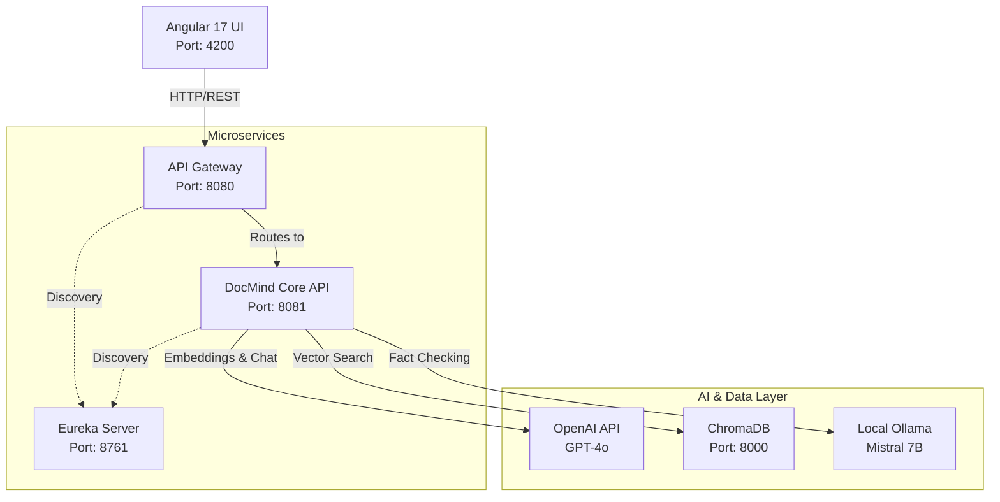

# DocMind System Documentation

This document provides a comprehensive technical overview of the DocMind application, covering the architecture, microservices, frontend, databases, and the core AI/RAG integration details.

---

## 1. System Overview

DocMind is a production-ready Document QA and Retrieval-Augmented Generation (RAG) system built with **Spring Boot/Cloud**, **Spring AI**, **LangGraph4j**, and an **Angular 17** frontend. The system is designed using a microservices architecture to ensure scalability, modularity, and robust orchestration.

---

## 2. Architecture Diagram



---

## 3. Microservices Backend

### 3.1. `docmind-eureka-server` (Service Discovery)
- **Port:** `8761`
- **Purpose:** Acts as the Netflix Eureka server for microservice registration and discovery.
- **Config (`application.yml`):**
  - `eureka.client.register-with-eureka`: false
  - `eureka.client.fetch-registry`: false

### 3.2. `docmind-gateway` (API Gateway)
- **Port:** `8080`
- **Purpose:** Central entry point for the frontend. Handles routing, load balancing, and CORS configuration.
- **Config (`application.yml`):**
  - Routes configured for `/api/v1/**` mapping to `lb://docmind-api`
  - Global CORS configuration allowing `http://localhost:4200` with standard HTTP methods.

### 3.3. `docmind-api` (Core Business Logic)
- **Port:** `8081` (Dynamic if scaled)
- **Purpose:** Handles document ingestion, vectorization, RAG workflows, and chat interactions.
- **Key Methods & Endpoints:**
  - `POST /api/v1/documents/ingest`: Accepts multipart file uploads. Parses documents (e.g., PDF) using Spring AI `TikaDocumentReader`, splits them using `TokenTextSplitter`, and stores embeddings in ChromaDB.
  - `POST /api/v1/chat`: Initiates the RAG chat pipeline using LangGraph4j orchestration.
- **Configurations:**
  - `spring.ai.openai.api-key`: Uses `OPENAI_API_KEY` for primary LLM interactions.
  - `spring.ai.vectorstore.chroma`: Configured to connect to `http://localhost:8000`.

---

## 4. Frontend (Angular UI)

- **Framework:** Angular 17 (Standalone Components)
- **Port:** `4200`
- **Theme:** Modern Dark Theme with glassmorphism UI/UX.
- **Key Components:**
  - `SidebarComponent`: Navigation and Document List.
  - `ChatAreaComponent`: Handles user input and displays real-time RAG pipeline state.
  - `DocumentUploadComponent`: Drag-and-drop interface for ingestion.
- **Services:**
  - `DocumentService`: Handles HTTP `POST` for multipart form data ingestion.
  - `ChatService`: Manages chat state and communicates with the `/api/v1/chat` endpoint.

---

## 5. Database & Storage

### 5.1. ChromaDB (Vector Store)
- **Deployment:** Docker Container (`chromadb/chroma`)
- **Port:** `8000`
- **Collection Name:** `docmind-kb`
- **Storage Strategy:** Stores text chunks and associated vector embeddings.
- **Metadata Stored:**
  - `fileName`: Original name of the document.
  - `fileSizeBytes`: Size of the ingested document.
  - `chunkId`: Unique identifier for the split segment.

---

## 6. AI Models & Parameters

DocMind utilizes a hybrid LLM approach, combining cloud-based and local models for optimal cost-performance and latency.

### 6.1. Main LLM: OpenAI GPT-4o
- **Usage:** Primary chat completion, reasoning, and generating vector embeddings.
- **Context Window:** 128,000 tokens
- **Max Output Tokens:** ~4,096 tokens
- **Temperature Configuration:** Usually set to `0.7` for chat generation to balance creativity and factual accuracy.
- **Embedding Model:** `text-embedding-3-small` (or `text-embedding-ada-002`) - Dimensions: 1536.

### 6.2. Verification LLM: Mistral 7B (via Local Ollama)
- **Usage:** Used primarily in the validation/fact-checking node of the RAG pipeline to ensure the generated answer is grounded in the retrieved context.
- **Context Window:** 8,192 tokens (standard local deployment)
- **Temperature Configuration:** `0.0` or `0.1` (Strict deterministic output for validation).
- **Deployment:** Runs locally in a Docker container alongside the API to eliminate network latency and data privacy concerns for sensitive validation tasks.

---

## 7. Retrieval-Augmented Generation (RAG) Architecture

The RAG pipeline is orchestrated using **LangGraph4j**, implementing a stateful, cyclic graph workflow.

### 7.1. State Object (`RagState`)
Maintains the state across graph nodes:
- `userQuery`: The original question.
- `retrievedContext`: List of document chunks retrieved from ChromaDB.
- `generatedAnswer`: The draft response from GPT-4o.
- `isAnswerValid`: Boolean flag from the Mistral validation node.

### 7.2. Pipeline Nodes
1. **Retrieve Node:**
   - Executes a similarity search against ChromaDB using the embedded `userQuery`.
   - **Parameters:** `Top-K = 4` (retrieves the top 4 most relevant chunks), `Similarity Threshold = 0.75`.
2. **Generate Node:**
   - Prompts GPT-4o with the `userQuery` and `retrievedContext` to synthesize an answer.
3. **Validate Node (Mistral):**
   - A specialized fact-checking prompt is sent to Mistral via Ollama. It compares the `generatedAnswer` against the `retrievedContext`.
   - If Mistral detects hallucinations or ungrounded claims, it flags `isAnswerValid = false`.
4. **Conditional Edge:**
   - If `isAnswerValid` is true -> **END** (Return answer to user).
   - If `isAnswerValid` is false -> Loop back to **Retrieve Node** (potentially expanding search parameters) or return a fallback safe answer.

---

## 8. Development & Operations

### 8.1. Docker Compose (`docker-compose.yml`)
Spins up necessary local infrastructure:
- **ChromaDB:** Persistent volume mounted to `./data/chroma`.
- **Ollama:** Exposes port `11434` for the Mistral model. Includes a health check to ensure the model service is ready before the API boots.

### 8.2. Startup Script (`run-api.sh`)
Helper script that ensures the `OPENAI_API_KEY` is present in the environment before starting the Spring Boot microservices.

```bash
# Example Usage
export OPENAI_API_KEY="sk-..."
./run-api.sh
```
